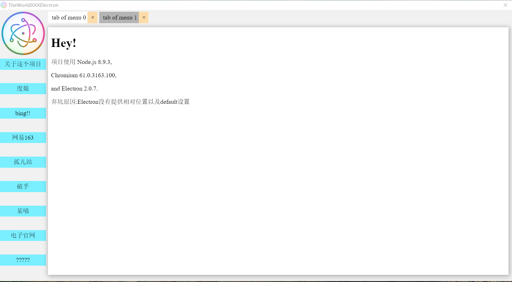
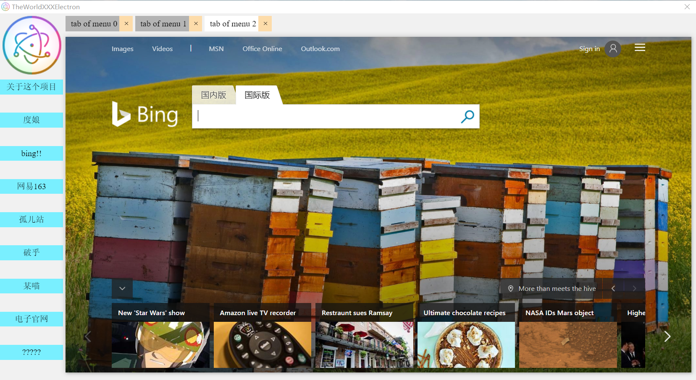

# TheWorldXXXElectron

一个跨平台的electron浏览器？界面准备抄袭世界之窗7和百分浏览器，说不定可以融资融他2个E( • ̀ω•́ )✧

## 已经弃坑

弃坑原因:Electron没有提供相对位置以及default设置

## 下载
## 绿色版（<del>一个月后</del>已删除）

> 如有需要请自行编译打包(需要electron,electron-packager)
    
项目使用 Node.js 8.9.3,

    
Chromium 61.0.3163.100,

    
和 Electron 2.0.7.

    
<del>[TheWorldXXXElectron-linux64-portable](https://github.com/grdaimap/TheWorldXXX/blob/%E5%BA%9F%E5%BC%832-TheWorldXXXElectron/outApp/TheWorldXXXElectron-linux-x64.7z)</del>

<del>[TheWorldXXXElectron-mac64-portable](https://github.com/grdaimap/TheWorldXXX/blob/%E5%BA%9F%E5%BC%832-TheWorldXXXElectron/outApp/TheWorldXXXElectron-darwin-x64.7z)</del>

<del>[TheWorldXXXElectron-windows64-portable](https://github.com/grdaimap/TheWorldXXX/blob/%E5%BA%9F%E5%BC%832-TheWorldXXXElectron/outApp/TheWorldXXXElectron-win32-x64.7z)</del>
____________
## windowsX64安装版（永久保存,卸载请到控制面板卸载,卸载完请手动删除安装目录）
[TheWorldXXXElectron-windows64-installer](https://raw.githubusercontent.com/grdaimap/hello-world/master/TheWorldXXX--2-TheWorldXXXElectron/outApp/WindowsX64Setup.exe)

> PS: 你electron\*\*打包后这么大再跨平台也没什么人敢用啊!

> PPS: 切换效果感谢大佬ekoo-- [segmentfault.com/q/1010000010805436](https://jsfiddle.net/zpxtyLbp/1/)

_______________

## 截图

